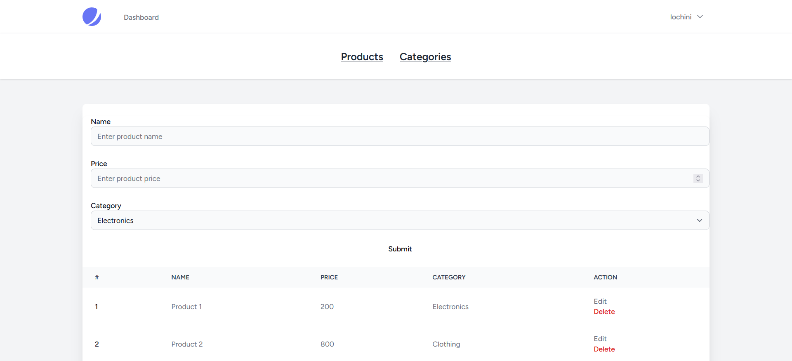
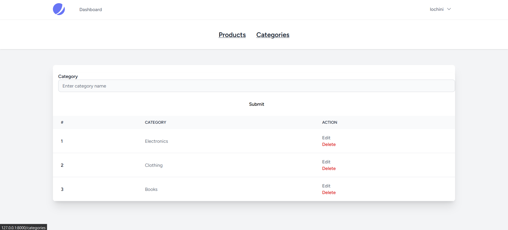

ABC Shop - Laravel CRUD Application

Introduction

ABC Shop is a simple CRUD (Create, Read, Update, Delete) application developed using Laravel. It allows you to manage categories and products through an easy-to-use web interface.
Features

    Create, Read, Update, and Delete (CRUD) operations for categories and products.
    User-friendly interface for managing your shop's inventory.

Getting Started
Prerequisites

Before getting started, make sure you have the following prerequisites installed:

    PHP (>=8.1)
    Composer
    Laravel

Installation

    Clone this repository:

    bash

git clone https://github.com/Is116/abc-shop.git

Navigate to the project directory:

bash

cd abc-shop

Install the required packages:

bash

composer install

Create a .env file by copying the example:

bash

cp .env.example .env

Generate an application key:

bash

php artisan key:generate

Set up your database configuration in the .env file:

env

DB_CONNECTION=mysql
DB_HOST=127.0.0.1
DB_PORT=3306
DB_DATABASE=your_database_name
DB_USERNAME=your_database_username
DB_PASSWORD=your_database_password

Run the migrations and seed the database:

bash

php artisan migrate --seed

Start the development server:

bash

    php artisan serve

    Access the application in your web browser at http://localhost:8000.

Usage

    Manage Categories: Create, edit, and delete product categories.

    Manage Products: Add, update, and delete products, associating them with categories.

    

This project is open-source and available under the MIT License.

